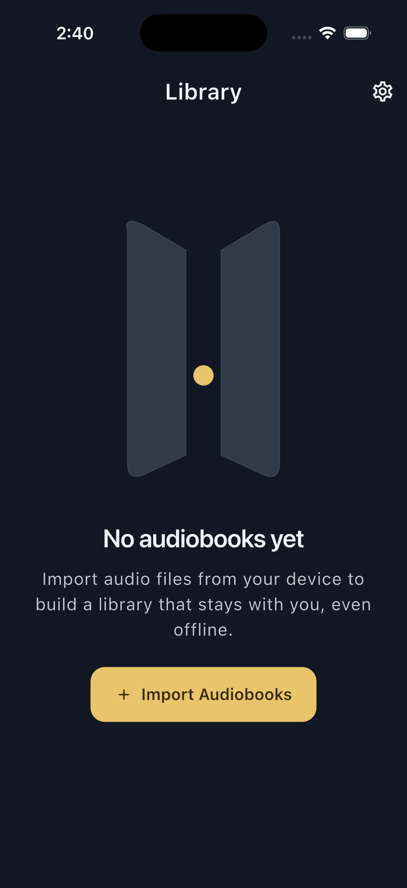

# Audiobooks

An offline-first Flutter audiobook player for audio files you already own.



## Current milestone

The foundation release includes:

- A polished adaptive Library with light and dark themes.
- Native file selection for MP3, M4A, M4B, and AAC files.
- Durable, app-owned local media storage.
- A Drift database for books, chapters, progress, and bookmarks.
- Feature-first architecture with Cubit, repositories, dependency injection,
  and typed routing.
- Unit, widget, repository, and golden tests.

Each selected file is currently imported as a separate audiobook. Metadata
editing, multi-file book grouping, book details, and playback are planned for
the next milestones.

## Development

Flutter 3.44.7 is pinned through FVM.

```sh
fvm flutter pub get
fvm flutter analyze
fvm flutter test
fvm flutter run
```

The iOS target requires iOS 14 or newer.

## Project documentation

- [`PRODUCT.md`](PRODUCT.md) describes product principles and scope.
- [`DESIGN.md`](DESIGN.md) documents the visual system and reusable tokens.
- [`.impeccable/surfaces/library.md`](.impeccable/surfaces/library.md) records
  the approved Library composition contract.
